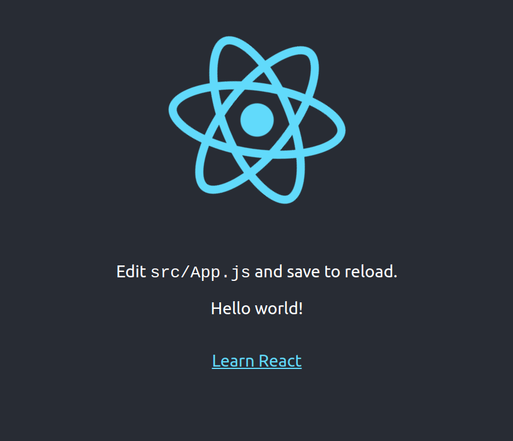

# Spring Boot + React Archetype

An archetype with Spring Boot + React

### Requirements:
- Java 19
- Maven

Maven takes care of installing Node and npm locally to install and build the front-end.
Node and npm versions are defined in the POM of the frontend module.

### Install:
```
> mvn clean install
```

### Swagger Documentation
The API documentation is available via Swagger UI at [http://localhost:8080/swagger-ui/index.html](http://localhost:8080/swagger-ui/index.html). This interface allows you to explore and test the API endpoints defined in the application.

### Application UP
The application at http://localhost:8080. The "hello world!" message is a endpoint call to backend.


### Docker
To run the application using Docker, you can use Docker Compose. Make sure you have Docker and Docker Compose installed on your machine. You can start the application with the following command:
```
> docker-compose up
```
This command will build the Docker images and start the containers defined in your `docker-compose.yml` file. Once the application is running, you can access it at [http://localhost:8081](http://localhost:8081).
